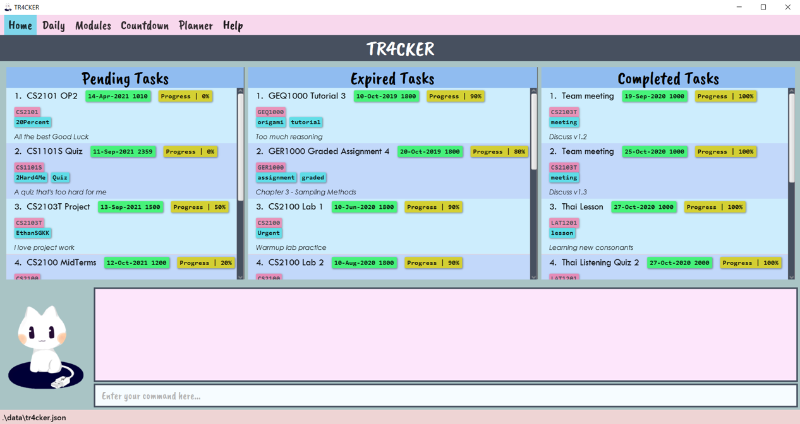

TR4CKER is a desktop app that helps SoC students track their tasks, meet their deadlines, and stay productive. It is optimized for Computing students familiar with CLI, who can manage their tasks efficiently by typing in commands.

* Table of Contents
{:toc}

--------------------------------------------------------------------------------------------------------------------

## Quick start

1. Ensure you have Java `11` or above installed in your Computer.

1. Download the latest `tr4cker.jar` from [here](https://github.com/AY2021S1-CS2103T-T10-2/tp/releases).

1. Copy the file to the folder you want to use as the _home folder_ for your TR4CKER.

1. Double-click the file to start the app. The GUI similar to the below should appear in a few seconds. Note how the app contains some sample data. 
   

1. Type the command in the command box and press Enter to execute it. e.g. typing **`help`** and pressing Enter will open the help window. 
   Some example commands you can try:

   * **`list`** : Lists all tasks.

   * **`add`**`n/Do CS2103T tP v1.1 d/2020-09-24 2359` : Adds a task, `Do CS2103T tP v1.1` to TR4CKER.

   * **`delete`**`3` : Deletes the 3rd task shown in the current list.

   * **`clear`** : Deletes all tasks.

   * **`exit`** : Exits the app.

1. Refer to the [Features](#features) below for details of each command.

--------------------------------------------------------------------------------------------------------------------

## Features

**:information_source: Notes about the command format:** 

* Words in `UPPER_CASE` are the parameters to be supplied by the user. 
  e.g. in `add n/NAME`, `NAME` is a parameter which can be used as `add n/CS2103 tP`.

* Items in square brackets are optional. 
  e.g `n/NAME [t/TAG]` can be used as `n/CS2103 tP t/important` or as `n/CS2103 tP`.

* Items with `…`​ after them can be used multiple times including zero times. 
  e.g. `[t/TAG]…​` can be used as ` ` (i.e. 0 times), `t/important`, `t/important t/exciting` etc.

* Parameters can be in any order. 
  e.g. if the command specifies `n/NAME d/DEADLINE`, `d/DEADLINE n/NAME` is also acceptable.

### Viewing help : `help`

Shows a message explaning how to access the help page.

Format: `help`

### Adding a task: `add`

You can add a task to TR4CKER. The default deadline timing would be set to 2359 if you do not specify a deadline time.

Format: `add /n [TASK_NAME] /d [DEADLINE]`

:bulb: **Tip:**
Enter deadline in the format: yyyy-MM-dd [HHmm]

Examples:
* `add /n prepare for tP /d 2020-09-12 1900`
* `add /n CS2101 Oral Presentation 1 /d 2020-09-29`

### Marking tasks as done: `done`

Marks the tasks you have completed as done in TR4CKER.

Format: `done [INDEX]…​`

* Marks the task as done at the specified INDEX.
* The index refers to the index number shown in the task list.
* The index must be a positive integer 1, 2, 3, …​
* The index can have multiple indexes with a space in between.
* Specified task number(s) will be marked as completed.

Examples:
* `done 1` Marks the 1st task as done.
* `done 2 3 4` Marks the 2nd, 3rd, and 4th task as done.

### Deleting a task: `delete`

Deletes the specified task(s) from TR4CKER.

Format: `delete [INDEX]…​`

* Deletes the task at the specified INDEX.
* The index refers to the index number shown in the task list.
* The index must be a positive integer 1, 2, 3, …​
* The index can have multiple indexes with a space in between.

Examples:
* `delete 2` deletes the 2nd task in the task list.
* `delete 2 3 4` deletes the 2nd, 3rd and 4th tasks in the task list.

### Listing all tasks : `list`

Shows a list of all tasks in TR4CKER.

Format: `list`

### Editing a task name : `edit`

Edits an existing task’s details in TR4CKER.
Format: `edit [INDEX] /n [TASK_NAME] /d [DEADLINE]`

* Edits the task’s description and/or deadline at the specified INDEX. 
* The index refers to the index number shown in the task list. 
* The index must be a positive integer 1, 2, 3, …​
* Existing task’s details will be updated to the new task’s details being inputted.

Examples:
* `edit 1 /n prepare for tP tasks` Edits the description of the 1st task to be prepare for tP tasks
* `edit 2 /d 2020-09-13 1930` Edits the deadline time of the 2nd task to be 13 Sep 2020, 1900 hrs.

### Locating tasks by keyword: `find`

Find tasks whose descriptions match any of the given keywords.

Format: `find [KEYWORD_1] [KEYWORD_2]…​`

* The search is case-insensitive. e.g cs2101 will match CS2101
* Only full words will be matched e.g. 2101 will not match cs2101
* Persons matching at least one keyword will be returned. e.g. find CS2101 project will return CS2101 Oral Presentation 1,  CS2103T team project

Examples:
* `find CS2101` returns `CS2101 Oral Presentation 1`
* `find CS2101 project` returns `CS2101 Oral Presentation 1`,  `CS2103T team project`

### Clearing all entries : `clear`

Clears all entries from TR4CKER.

Format: `clear`

### Exiting TR4CKER : `exit`

Exits TR4CKER.

Format: `exit`

### Saving the data

TR4CKER data are saved in the hard disk automatically after any command that changes the data. There is no need to save manually.

### Archiving data files `[coming in v2.0]`

_{explain the feature here}_

--------------------------------------------------------------------------------------------------------------------

## FAQ

**Q**: How do I transfer my data to another Computer? 
**A**: Install the app in the other computer and overwrite the empty data file it creates with the file that contains the data of your previous TR4CKER home folder.

--------------------------------------------------------------------------------------------------------------------

## Command summary

Action | Format, Examples
--------|------------------
**Add** | `add /n [TASK_NAME] /d [DEADLINE]`   e.g., `add /n prepare for tP /d 2020-09-12 1900`
**Clear** | `clear`
**Delete** | `delete INDEX`  e.g., `delete 3`
**Edit** | `edit [INDEX] /n [TASK_NAME] /d [DEADLINE]`  e.g.,`edit 2 /d 2020-09-13 1930`
**Find** | `find KEYWORD [MORE_KEYWORDS]`  e.g., `find CS2101`
**List** | `list`
**Help** | `help`
